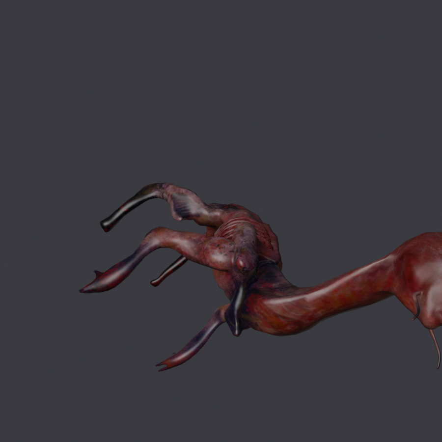

# cryWolf — `FIEND`

**Qué es.** Un cuadrúpedo de cuello largo, remallado y retexturizado a partir de
*"Cry Wolf Game Character"* de SkinRender (Sketchfab, CC BY 4.0).

**A quién sustituye.** `FIEND`, el horror grande que erupciona de los huevos en
los planetas infestados y te persigue por la superficie.

| | |
|---|---|
| Rig | `SPIDERRIG` |
| Nodo de malla | `_Fiend_Body` |
| Escena | `MODELS\PLANETS\CREATURES\SPIDERRIG\FIEND` |
| Material | `FIEND\FIEND_MAT.MATERIAL.MBIN` |
| `giro` | `(-90, 180)` |
| `pose` | **`grados=30, desde=0.45, hasta=0.15`** — el doblez del cuello |
| `alto` | **2.850 m** (vanilla: 1,34 m de esqueleto) |
| `.blend` final | `BLENDER/proyectos/crywolf_nms.blend` |
| Publicado | `releases/models-0.1.0/infestedCryWolf_v0.1.0.zip` |

## Cómo se hizo

Segunda hornada (2026-09), junto al warrior bug. **Es el modelo que destapó la
causa de fondo de las dieciocho pruebas anteriores**, y por eso tiene tres cosas
que ninguno de los otros:

**1. La escala se midió, no se eligió.** Los acuerdos B1/B2 lo habían subido a
3,62 m «porque se veía enano». El precio salió al medirlo: el esqueleto `FIEND`
mide 1,34 m, así que a 3,62 m **el 59,5 % de la malla queda por encima del último
hueso** y `RootJNT` se llevaba el 64,6 % del peso (tope 25,5). La `PRUEBA02` la
dobló a 3,80 m y en partida salió demasiado grande; la `PRUEBA03` la dejó en
**2,85 m**, elegido en partida y no en la mesa.

**2. El doblez del cuello (`pose`).** El asset viene con el cuello a **35° sobre
la horizontal**, medido sobre la malla ya girada: arranca en `z 0,45` —donde el
ancho en `x` salta de 0,08 a 0,15— y la cabeza vive en `z 0,00..0,10`. En partida
eso se lee como «la cabeza va por delante» y «le pesa la cabeza». **No es el
pesado**: el 04/09 se deformó la misma malla con los pesos de la `PRUEBA03` y los
de la `PRUEBA04` y los dos renders salen iguales. Es la postura del asset. Con 30°
el cuello pasa de 35° a 65° y la cabeza se adelanta 0,109 en vez de 0,213.

**3. Mapa a mano igualmente.** Cry wolf y `FIEND` son **los dos cuadrúpedos** y
aun así hizo falta: la altura rompe la vecindad aunque el tipo de animal coincida.

**Atlas**: sí. `crywolf_atlas.blend`. Le pasó el problema de los mips con el
**50,1 % del atlas a 255**.

## Qué salió mal

- **`PRUEBA06` (`Retarget-NMSRig.py`)**: reescribir los nueve `.ANIM` del vanilla
  a propósito. **Se construyó, se desplegó, se midió y salió PEOR. Retirado.**
- **Abierto**: las patas oscilan menos de lo que deberían. La malla cuelga de la
  cadera, la parte baja de la pata sigue al cuerpo en vez de plantarse. Se lee
  como andar rígido.
- **Abierto**: es más alto que el bicho al que sustituye y se clava en el
  decorado bajo.

## Lo siguiente

Lo releva el **`xeno-cuadripedo`** (`asset/Modelos 3D/xeno-cuadripedo.zip`). Ojo:
viene en **`.glb` con animación**, no en FBX — hay que importar y quedarse con la
malla antes de entrar en `Decimate-NMSMesh.py`.

## Créditos

Modelo: *"Cry Wolf Game Character"* ([skfb.ly/6VFUz](https://skfb.ly/6VFUz)) por
**SkinRender**, CC BY 4.0. Remallado, retexturizado y repesado para NMS.
Mod de **AldrichDDD**.
