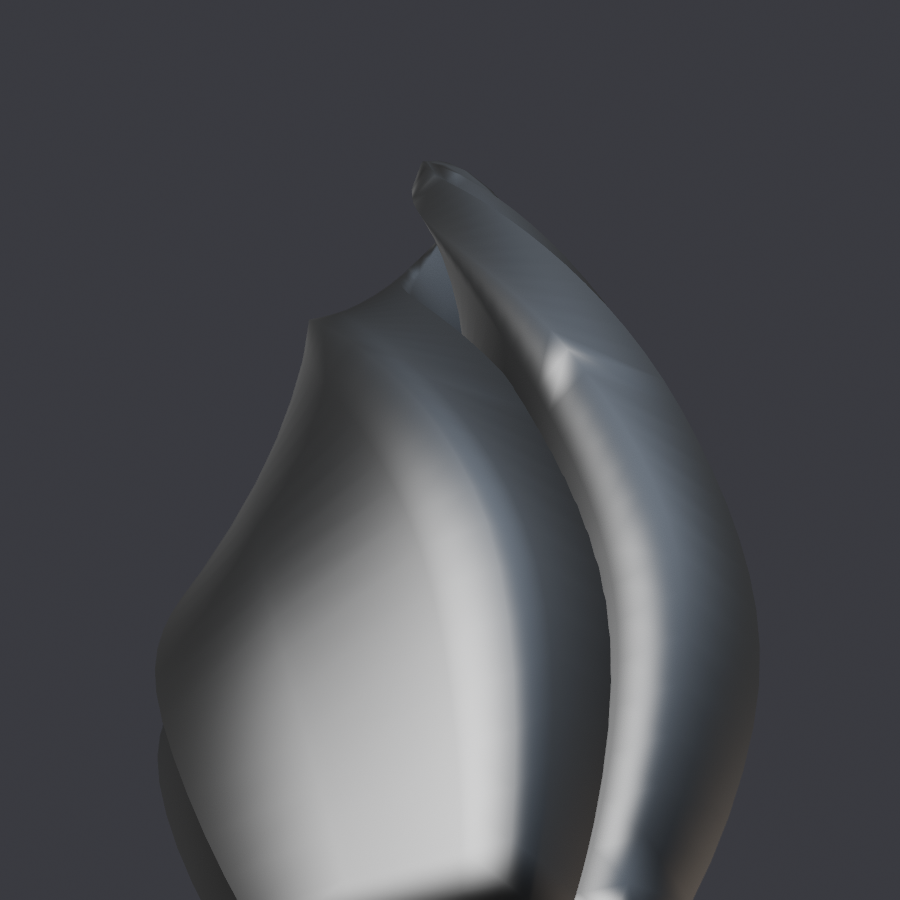

# markerEgg — `FIENDEGG` · **relevado por el [facehuggerEgg](facehuggerEgg.md)**

> Desde `models-0.1.2` los dos se publican. Escriben el mismo `FIENDEGG` y
> **no se instalan a la vez**; el jugador elige uno.

**Qué es.** Un monolito tallado, sacado de *"Marker 1"* de username11420
(Sketchfab, **CC BY-SA 4.0**).

**A quién sustituye.** `FIENDEGG`, los huevos del suelo de los planetas
infestados: los que se abren y te echan los horrores encima.

| | |
|---|---|
| Rig | **ninguno.** Es un prop estático, no lleva piel |
| Nodo de malla | `FiendEgg` |
| Escena | `MODELS\PLANETS\BIOMES\COMMON\RARERESOURCE\GROUND\FIENDEGG` |
| Material | `FIENDEGG\EGGSHELL_MAT.MATERIAL.MBIN` |
| `giro` | **`(0, 0)`** — el FBX ya viene con el eje alto en Y |
| `alto` | **`None`** — no se reescala |
| Fuente | `asset/Modelos Descomprimidos/Obelisco/source/marker_1.fbx` |
| `.blend` | `BLENDER/proyectos/marker.blend` |
| Publicado | `releases/models-0.1.1/infestedMarkerEgg_v0.1.1.zip` |

## Cómo se hizo

**Es el más corto de los cinco y el único que entra directo desde FBX**: no pasa
por `origen`/`objeto`, `Export-NMSMesh.py` importa el `.fbx` y coge la primera
malla. Sin piel, sin pesos, sin `Weight-` ni `Skin-` ni `Check-NMSGraft`. 822
vértices.

**Y es el que enseñó el fallo nº 6 del exportador**, el que no reporta nadie ni
Blender ni el juego: *NMSDK escribe `data.vertices[vi].co`, que son coordenadas
**locales**, e ignora la escala del objeto.* El FBX del marker importa con
`scale = 0.01`, así que en Blender se veía de 1,63 m y al juego iba **de 163**.
Hay que **aplicar la escala** — sólo la escala; la rotación se deja, porque deja
el eje alto en Y, que es el «arriba» de NMS.

## Qué salió mal

Nada reportado. Es estático y va a escala del huevo al que sustituye.

## Licencia — ojo, es distinta

El original es **ShareAlike**, así que **el modelo y las texturas de esta descarga
se quedan bajo CC BY-SA 4.0**: se pueden reusar y adaptar siempre que se cite y se
comparta igual. Los otros tres son CC BY, que no arrastra esa obligación.

## Lo siguiente

Lo releva el **`facehugger-egg`** (`asset/Modelos 3D/facehugger-egg.zip`, 3 MB).
Es huevo cerrado y suelto, un solo par de texturas D/N → entra por la misma vía
corta que el marker y **no necesita atlas**. La malla va en un `.zip` anidado
(`source/xenoEgg.zip`).

## Créditos

Modelo: *"Marker 1"* ([skfb.ly/6SzLo](https://skfb.ly/6SzLo)) por **username11420**,
CC BY-SA 4.0. Remallado y retexturizado para NMS. Mod de **AldrichDDD**.
