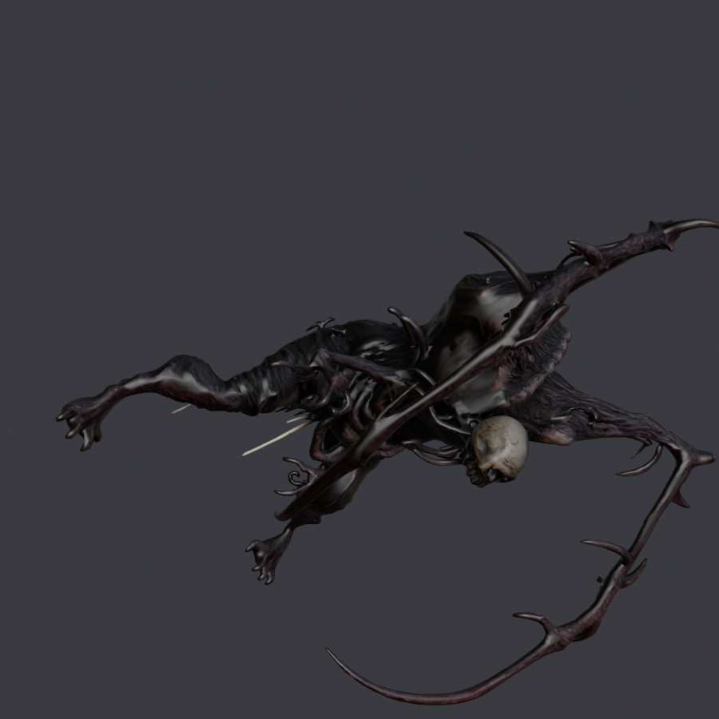

# necromorph — `FIEND` · **retirado**

**Qué es.** Un bípedo tipo necromorfo, sacado de un asset texturizado con Tripo
(`tripo_convert_28ab8120….fbx`).

**Ocupaba** `FIEND`, el horror grande de los planetas infestados. **No se publicó**:
lo relevó el [cry wolf](cryWolf.md), que es cuadrúpedo como el vanilla.

| | |
|---|---|
| Rig | `SPIDERRIG` |
| Nodo de malla | `_Fiend_Body` |
| `giro` | `(-90, 180)` |
| `alto` | **3.619638 m** (acuerdo B1) |
| `espejo` | `L` / `R` al principio del nombre |
| `.blend` final | `BLENDER/proyectos/necromorph_nms.blend` |

## Cómo se hizo, y qué aportó

**Es el modelo con el que se automatizaron los cinco pasos de meter la malla**
(2026-08-20). Con el SkullCrawler se habían hecho a mano y costaron once pruebas;
aquí salieron `Decimate-`, `Atlas-`, `Export-`, `Graft-` y `Patch-NMSMesh.py`.

- **Decimado**: 59 384 → **43 336 vértices** (30,30 %), error −0,147. Es la malla
  más pesada de todas.
- **Atlas**: sí, `necromorph_atlas.blend`. Es el modelo por el que existe
  `Atlas-NMSMesh.py`: trae varias texturas y hay que unirlas.
- **Influencias por vértice**: 1,71 → **2,10** tras el repesado. Peso en los
  miembros: 60,4 % → 60,5 %.

## Por qué se retiró

**Un bípedo montado sobre un rig de araña.** Copiar los pesos del vecino más
cercano —lo que funcionó en el SkullCrawler— aquí no vale: el `SPIDERRIG` reparte
por patas y nuestra malla tiene torso y brazos. Hizo falta `tope_reparto = 0.85`
y **el mapa a mano región → hueso**, sacado del volcado y no de suponer.

Y encima la escala: a 3,62 m sobre un esqueleto de 1,34 m, **el 59,5 % de la malla
queda sin hueso encima**. Ocho pruebas. Con el zombie fueron diez más. La lectura
de entonces —«es que son bípedos»— era sólo la mitad: **el bipedismo lo agravaba,
pero lo que rompe es la escala**. Eso no se entendió hasta el cry wolf.

## Lo que sobrevive

- `Atlas-NMSMesh.py` y los cinco pasos automatizados.
- El mapa a mano: en el `SPIDERRIG` la medida posterior **confirmó** el mapa que
  ya había, así que el necromorfo no hubo que retocarlo.
- El `.blend`, el atlas y las texturas siguen en `BLENDER/proyectos/`.
