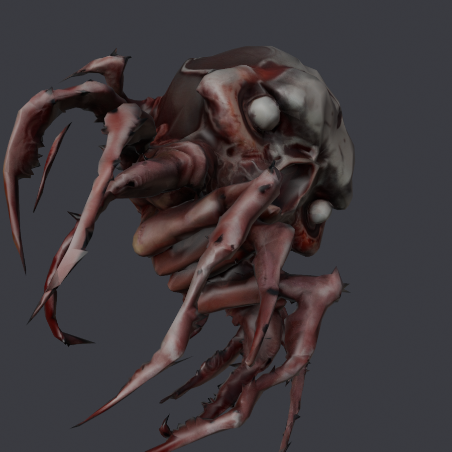

# skullCrawler — `FREIGHTERFIEND`

**Qué es.** Una criatura original, modelada a mano. No deriva de ningún asset de
terceros, así que es el único de los cuatro sin licencia que arrastrar.

**A quién sustituye.** `FREIGHTERFIEND`, el horror que anida en los cargueros
abandonados: el que te espera en los pasillos a oscuras.

| | |
|---|---|
| Rig | `SPIDERRIG` |
| Nodo de malla | `polySurface6` |
| Escena | `MODELS\PLANETS\CREATURES\SPIDERRIG\FREIGHTERFIEND` |
| Material | `FREIGHTERFIEND\FFIENDMAT.MATERIAL.MBIN` |
| `giro` | `(-90, 180)` |
| `alto` | **1.85069 m** — la altura exacta del vanilla |
| `escala_piel` | `"altura"` |
| `tope_reparto` | `None` |
| `.blend` final | `BLENDER/proyectos/scuttler30k.blend` |
| Publicado | `releases/models-0.1.0/infestedSkullCrawler_v0.1.0.zip` |

## Cómo se hizo

**Es el modelo con el que se escribió la receta** (2026-08-15). Los cinco pasos de
meter la malla se hicieron **a mano y costaron once pruebas**; de ahí salieron
`Decimate-`, `Export-`, `Graft-` y `Patch-NMSMesh`, que automatizaron el resto.

- **Decimado**: 11 357 → **6 537 vértices** (30,89 %), error 0,044.
- **Sin atlas**: una sola textura, así que `Atlas-NMSMesh.py` no hace falta.
- **Pesado**: `tope_reparto = None` y **sin mapa a mano**. Es el único caso donde
  copiar del vecino más cercano funcionó, y la razón está medida: *es una araña
  puesta sobre una araña*. Mismo tipo de animal y misma altura → las regiones caen
  donde tienen que caer solas.

## Qué salió mal

Nada que siga abierto. Es el más terminado de los cuatro: el ojo brillante apagado
y la espalda limpia. El `README.txt` de la release no reporta ningún fallo.

## Lo que enseñó

Que **el caso fácil es el que engaña**. Funcionó sin mapa a mano y eso hizo creer
que el pesado automático bastaba; el necromorfo y el zombie demostraron después
que sólo vale entre dos bichos del mismo tipo. Ver
[`../RECETA-PIEL.md`](../RECETA-PIEL.md) §3, «el mapa a mano».

## Créditos

Modelo original de **AldrichDDD**. Herramientas: AMUMSS (HolterPhylo),
MBINCompiler y NMSDK (monkeyman192), Blender.
