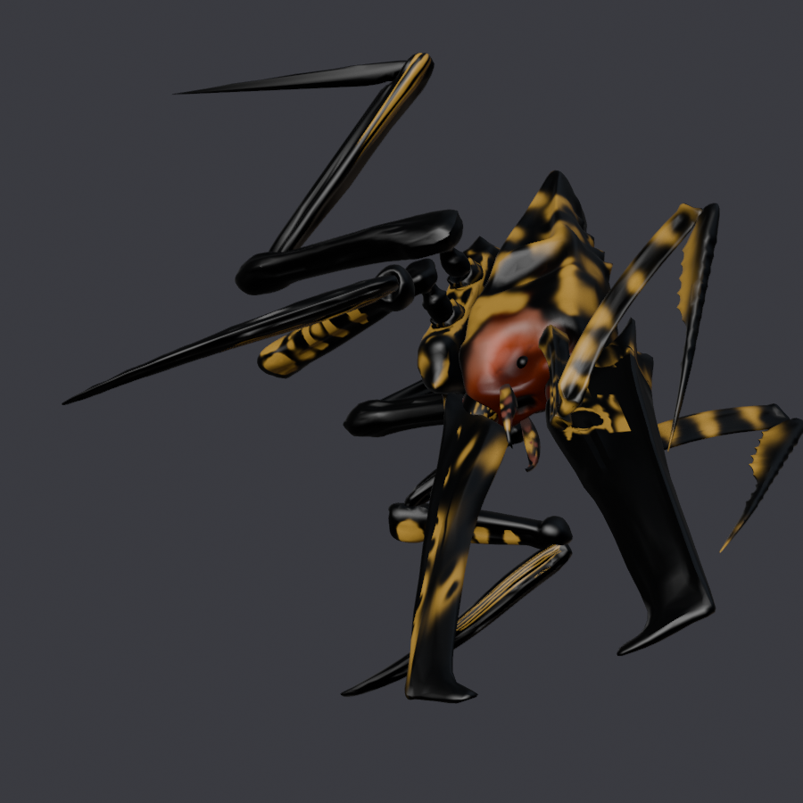

# warriorBug — `BUGFIEND`

**Qué es.** Un insecto acorazado, remallado y retexturizado a partir de
*"Warrior bug from 'Starship Troopers'"* de wtf_fox (Sketchfab, CC BY 4.0).

**A quién sustituye.** `BUGFIEND`, las crías que el horror grande escupe mientras
pelea contigo.

| | |
|---|---|
| Rig | `ARTHROPOD` |
| Nodo de malla | `ArthropodThorax` |
| Escena | `MODELS\PLANETS\CREATURES\ARTHROPOD\BUGFIEND` |
| Material | `BUGFIEND\ARTHROPODTHORAX01MAT.MATERIAL.MBIN` |
| `giro` | `(-90, 180)` |
| `alto` | **2.700 m** (vanilla: 1,05 m de esqueleto) |
| `espejo` | `_L` / `_R` en medio del nombre |
| `.blend` final | `BLENDER/proyectos/warriorbug_nms.blend` |
| Publicado | `releases/models-0.1.0/infestedWarriorBug_v0.1.0.zip` |

## Cómo se hizo

Segunda hornada, en paralelo al cry wolf. Tres cosas propias:

**1. El giro lo decidió la partida, no el volcado.** La `PRUEBA01` salió con
`giro=(-90, 0)` porque el décimo superior de la malla caía en `w 0,38` contra la
cabeza vanilla en `w 0,84` — o sea, el volcado decía que con 180 iba montado del
revés. **En partida salió de espalda con el 0.** El volcado estaba midiendo otra
cosa: *el décimo superior de un insecto son las patas levantadas, no la cabeza*.
El 180 de las otras tres entradas era el bueno.

**2. El mapa señalando al revés.** Con el mapa mal puesto, la región de la cabeza
cazaba la punta del abdomen. `head_C0_0_jnt` es el hueso correcto.

**3. El tope de vaivén hay que remedirlo con cada `alto`.** El mapa a mano va en
coordenadas **normalizadas** y no cambia con el tamaño; **el tope de vaivén sí**,
porque el vaivén es giro × palanca y el esqueleto del juego no crece con nosotros:

| Altura | Tope cabeza | Tope patas delanteras |
|---|---|---|
| 3,60 m | **255** (`todos` 510) | **375** (`todos` 750) |
| 2,70 m | **195** (`todos` 391) | **316** (`todos` 633) |

**Atlas**: sí. `warriorbug_atlas.blend`. Texturas de 22 MB por canal (las más
pesadas de los cuatro).

## Qué salió mal

- **Abierto**: las patas oscilan menos de lo que deberían — mismo fallo que el
  cry wolf, la malla cuelga de la cadera.
- **Abierto**: la piel se ve más plana de lo que debería con cierta luz. **Subir
  la resolución de la textura no lo arregló**, así que es problema de material y
  sigue sin resolver.

## Créditos

Modelo: *"Warrior bug from 'Starship Troopers'"* ([skfb.ly/o87nr](https://skfb.ly/o87nr))
por **wtf_fox**, CC BY 4.0. Remallado, retexturizado y repesado para NMS.
Mod de **AldrichDDD**.
