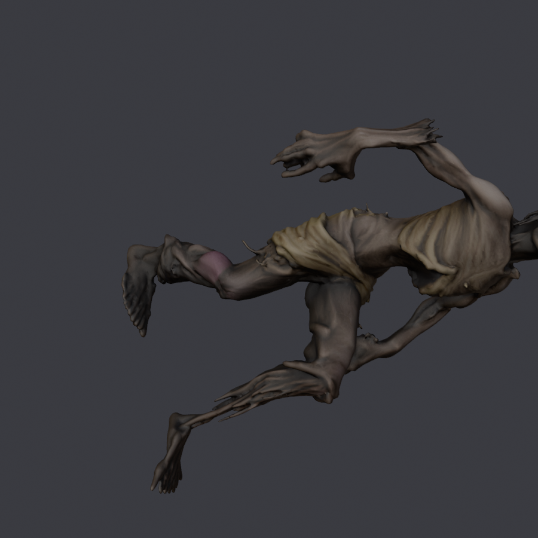

# zombie — `BUGFIEND` · **retirado**

**Qué es.** Un zombi bípedo, de *"Zombie Monster Slasher Necromorph"*, texturizado
con Tripo (`tripo_convert_9de8be52….fbx`).

**Ocupaba** `BUGFIEND`, las crías del horror grande. **No se publicó**: lo relevó
el [warrior bug](warriorBug.md), que es un insecto como el vanilla.

| | |
|---|---|
| Rig | `ARTHROPOD` |
| Nodo de malla | `ArthropodThorax` |
| `giro` | `(-90, 180)` |
| `alto` | **2.430 m** (acuerdo B2) |
| `espejo` | `_L` / `_R` en medio del nombre |
| `.blend` final | `BLENDER/proyectos/zombie_nms.blend` |

## Por qué se retiró

El mismo caso que el [necromorph](necromorph.md) y peor: **un bípedo sobre un rig
de artrópodo**. A 2,43 m sobre un esqueleto `ARTHROPOD` de 1,05 m,
**el 60,7 % de la malla queda por encima del último hueso** y `spine_C0_0_jnt` se
lleva el 43,0 % del peso con el tope en 39,3. El assert de reparto salta ahí, no
en el pesado.

**Diez pruebas.** Junto con las ocho del necromorfo son las dieciocho que se
leyeron mal como «es que son bípedos» y que el cry wolf explicó: lo que rompe es
la escala, no el bipedismo.

## Lo que sobrevive

La medida. De aquí salió el número que hay en
[`../RECETA-PIEL.md`](../RECETA-PIEL.md) §3: **si más de la mitad de la malla
queda por encima del último hueso, el pesado no tiene arreglo**; hay que bajar
`alto` o mapear a mano. Y la regla general que la cierra: *el esqueleto del
vanilla tiene que caber dentro de nuestra malla*.
